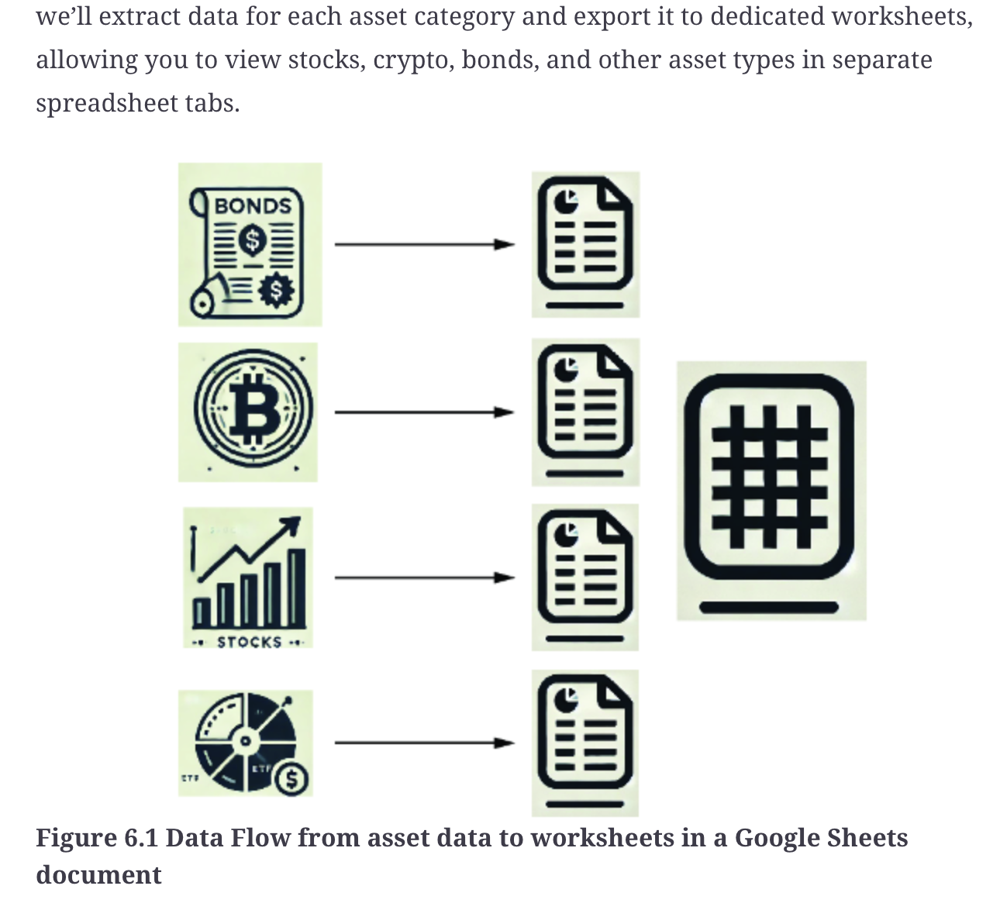

# investing_for_programmers
Investing for Programmers - Stefan Papp - Published by Manning Publications
ISBN: 9781633435803

# Links
1. [Repository with code from book](https://github.com/StefanPapp/investing-for-programmers/blob/main/ch06.ipynb)
1. [awesome-quant Repository](https://github.com/wilsonfreitas/awesome-quant)
1. [yfinance](https://pypi.org/project/yfinance/)

# Diagrams

# Creating new env
- uv init .
- uv venv
- uv add pandas yfinance